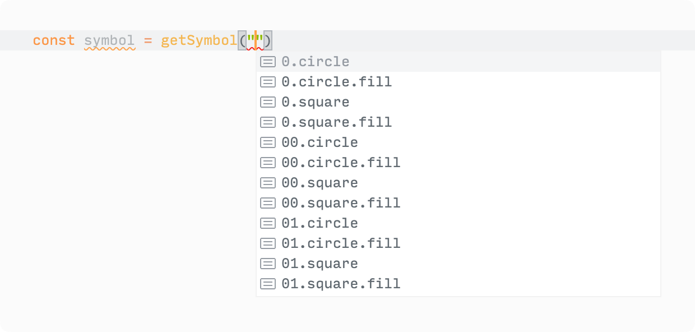

# ios-symbols

🔣 ️A collection of every symbol from SF Symbols.

[](https://github.com/bouchenoiremarc/ios-symbols/actions/workflows/ci.yml) [](https://www.npmjs.com/package/ios-symbols) [](https://www.npmjs.com/package/ios-symbols) [](https://github.com/bouchenoiremarc/ios-symbols/blob/main/LICENSE)

## Introduction

[SF Symbols](https://developer.apple.com/sf-symbols/) is a library of iconography from Apple, integrated into the San Francisco system fonts.

## Installation

#### Skypack

```html
<script type="module">
  import { symbols } from "https://cdn.skypack.dev/ios-symbols"
</script>
```

#### Yarn

```sh
yarn add ios-symbols
```

#### npm

```sh
npm install ios-symbols
```

## Usage

#### `symbols`

Import `symbols`.

```tsx
import { symbols } from "ios-symbols"

// symbols: {"0.circle": "􀀸", "0.circle.fill": "􀀹", ...}
```

#### `getSymbol`

Import `getSymbol`.

```tsx
import { getSymbol } from "ios-symbols"
```

Given a symbol name, `getSymbol` will return its symbol (or `undefined` for unknown symbols).

```tsx
const symbol = getSymbol("scribble.variable")

// symbol: "􀤑"
```

#### `getSymbolName`

Import `getSymbolName`.

```tsx
import { getSymbolName } from "ios-symbols"
```

Given a symbol, `getSymbolName` will return its name (or `undefined` for unknown symbols).

```tsx
const name = getSymbolName("􀣳")

// name: "lasso.sparkles"
```

## Automation

Symbols are extracted with the `generate` command—using the [SF Symbols](https://developer.apple.com/sf-symbols/) app.


#### Types

`generate` prepares types along its symbols which means `getSymbol` and `getSymbolName` will validate symbol names when using TypeScript.



## Related

[📏 ios-dimensions](https://github.com/bouchenoiremarc/ios-dimensions): A collection of dimensions from iOS.
